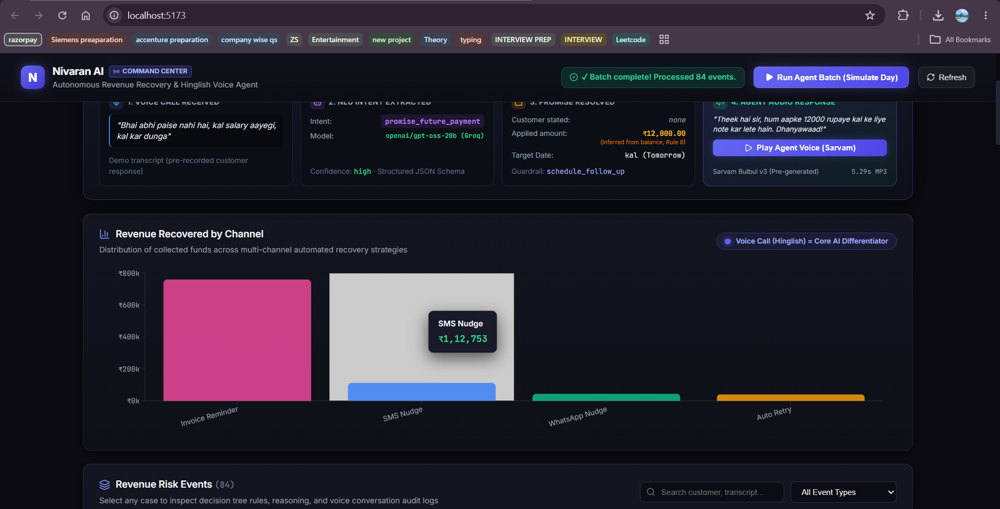

# Nivaran AI

Nivaran AI is an autonomous payment recovery agent that diagnoses transaction failures, extracts intent and commitment details from Hinglish voice transcripts via structured LLM outputs, and routes compliant recovery actions through a deterministic guardrail layer. It handles both automated retries and multi-channel interventions (SMS nudges, WhatsApp reminders, payment links, voice calls) while enforcing strict contact limits and compliance opt-out rules.

## How It Works

When a transaction failure or overdue invoice occurs, Nivaran AI ingests the event and classifies the root cause to determine an initial intervention strategy. A rule-based decision engine tracks attempt counts against per-cause stopping limits and sequentially escalates recovery interventions across channels (auto-retry, SMS nudge, WhatsApp reminder, payment link generation, and Hinglish voice calls). For voice interventions, the agent uses structured LLM outputs via Groq to extract payment intent and commitment details from conversational Hinglish transcripts. Extracted temporal references are resolved through a separate deterministic date resolver to eliminate LLM date hallucinations, while compliance rules (such as explicit opt-out requests or dispute claims) are evaluated independently from payment intent. Every decision, intervention action, and customer outcome is immutably recorded to provide an auditable decision trail.

## Repository Structure

The repository is organized into three primary directories:

- `backend/`: FastAPI service containing the core database models (SQLAlchemy/SQLite), decision engine, action executors, voice extraction pipeline, and dashboard reporting API.
- `frontend/`: React dashboard (built with Vite) that provides real-time visibility into recovery metrics, revenue breakdown by channel, event search, batch execution simulation, and full decision-to-outcome case audit trails.
- `research/`: Standalone validation suite, test harnesses, and reference audio used to prototype and harden the highest-risk, most novel components (conversational Hinglish intent extraction, temporal date resolution without LLM hallucination, and guardrail routing) before backend integration.

## Dashboard



## Getting Started

### Prerequisites

- Python 3.11+
- Node.js 18+ and npm
- Groq API key (for voice transcript extraction)

### 1. Backend Setup

Navigate to the `backend/` directory, create a virtual environment, install dependencies, and configure the environment:

```bash
cd backend
python -m venv venv
source venv/bin/activate  # On Windows: .\venv\Scripts\activate
pip install -r requirements.txt
```

Create a `.env` file in the `backend/` directory:

```env
DATABASE_URL=sqlite:///./dev.db
GROQ_API_KEY=your_groq_api_key_here
```

Seed the database with initial failure events:

```bash
python -m app.seed_data
```

Start the FastAPI application:

```bash
uvicorn app.main:app --host 127.0.0.1 --port 8000 --reload
```

The API will be available at `http://127.0.0.1:8000`. API documentation is accessible at `http://127.0.0.1:8000/docs`.

### 2. Frontend Setup

In a separate terminal, navigate to the `frontend/` directory, install dependencies, and launch the Vite development server:

```bash
cd frontend
npm install
npm run dev
```

The dashboard will run at `http://127.0.0.1:5173`.

### 3. Voice Pipeline Research Suite

The `research/` directory contains standalone test harnesses and reference audio used during voice pipeline development:

- `test_amount_extraction.py`: Validates numerical amount parsing and currency handling.
- `test_temporal_resolver.py`: Tests categorical and relative date resolution for Hinglish expressions (e.g., "kal", "parso", "agle hafte").
- `test_guardrails.py`: Confirms deterministic enforcement of compliance opt-outs, dispute escalations, and payment reconciliations.
- `audio/`: Reference audio recordings used for end-to-end transcription and extraction testing.

## Testing

The project includes test suites covering deterministic date resolution, compliance guardrail mapping, and end-to-end executor pipelines:

- **Temporal Date Resolution**: Validates past vs. future tense disambiguation, relative offsets ("kal", "parso", "agle hafte"), explicit dates, and conditional event-based triggers.
- **Guardrail Action Mapping**: Tests strict compliance overrides (contact suppression on opt-out or wrong number), dispute escalation routing, and payment reconciliation flags.
- **End-to-End Voice Pipeline Integration**: Verifies structured intent extraction, debt amount inheritance rules, and outcome state transitions across diverse Hinglish transcript profiles.

### Test Counts

- **Backend Test Suite**: 17 tests across `tests/test_executors.py` (3 tests), `tests/test_guardrail_mapping.py` (9 tests), and `tests/test_transcript_diversity.py` (5 tests).
- **Research Unit Test Suite**: 17 tests across `test_guardrails.py` (7 tests) and `test_temporal_resolver.py` (10 tests), supplemented by standalone live benchmark scripts (`groq_intent_test_suite.py`, `groq_temporal_test_suite.py`, `pipeline_test.py`).

### Running the Tests

To run the backend integration and mapping suite:

```bash
cd backend
pytest tests/ -v
```

To run the research validation suite:

```bash
cd research
pytest test_guardrails.py test_temporal_resolver.py -v
```
